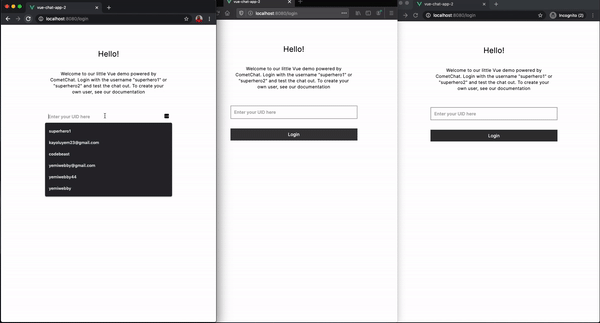
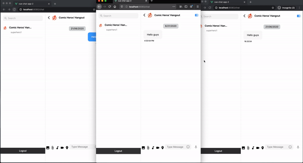

# Build a Vue chat app

Read the full tutorial here:

> > Not yet published

This application detailed the step by step guide on how to build a modern group chat application using Vue.js and CometChat.

Take a look at the screenshot below:





## Technology

This demo uses:

- [CometChat](https://cometchat.com/)
- [Vuejs](https://vuejs.org/)

## Running the demo

To run the demo follow these steps:

1. Head to the [CometChat dashboard](https://app.cometchat.com/) (you'll need to create a free account if you haven't already)
2. From the dashboard, create a new app called "vue-chat-app" or your preferred name.
3. Click **API Keys** on the left-hand-side and note the automatically-generated Full access API Key and the application ID as well
4. Go to the **Groups** tab and note the GUID of the group automatically created by CometChat
5. Download the repository [here](https://github.com/yemiwebby/vue-chat-app/archive/master.zip) or by running `git clone https://github.com/yemiwebby/vue-chat-app.git`
6. Run `npm install` to install all the project's dependencies
7. Create a `.env` file with the root folder of the project and paste the following content in it:

```
VUE_APP_COMMETCHAT_API_KEY=YOUR_API_KEY
VUE_APP_COMMETCHAT_APP_ID=YOUR_APP_ID
VUE_APP_COMMETCHAT_GUID=YOUR_GROUP_GUID
VUE_APP_COMMETCHAT_REGION=YOUR_APP_REGION
```

Replace `YOUR_API_KEY`, `YOUR_APP_ID`, `YOUR_GROUP_GUID` and `YOUR_APP_REGION` with your API KEY, APP ID GUID and REGION as obtained from your CometChat dashboard.

8. Run `npm run serve` to start the application and navigate to `http://localhost:8080` to view the app

9) Open the application in two or three separate windows and log in with any two of the test users: superhero1, superhero2, or superhero3

10) Once you are able to log in from both window, type a message and hit `Enter` on your keyboard to start a chat


## Useful links

- 🏠 [CometChat Homepage](https://www.cometchat.com/pro)
- 🚀 [Create your free account](https://app.cometchat.com/#/apps)
- 📚 [Documentation](https://prodocs.cometchat.com/docs)
- 👾 [GitHub](https://github.com/CometChat-Pro)
